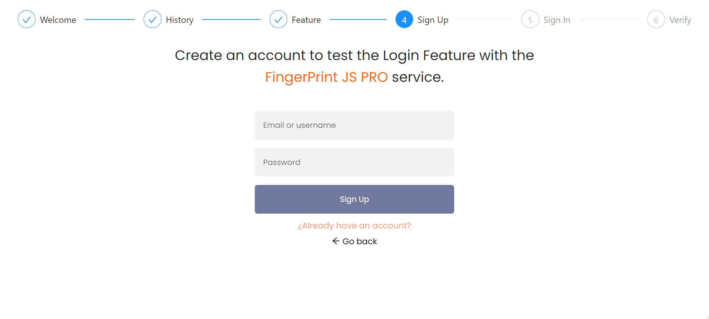

# FingerPrintJS - Login usage - showcase

> This Fullstack application will showcase how the FingerPrintJS Library can help the developers mitigate online frauds and vulnerabilities within the login in feature. 

More screenshots

## 📋 History 

## 📋 Feature

## 📋 Sign up

## 📋 Sign in feature

## Built With

- Front-End:
  - React js 
  - [FingerPrintPRO client agent](https://dev.fingerprintjs.com/docs/quick-start-guide)
  - Ant Design

- Back-End:
  - Node js
  - Express js
  - PostgreSQL
  - [FingerPrintPRO API](https://dev.fingerprintjs.com/docs/server-api)

## Getting Started

To get a local copy up and running follow these simple example steps.

### Prerequisites

- [Node js](https://nodejs.org/en/download/)
- [PostgreSQL](https://www.postgresql.org/download/)
- [FingerPrintJS PRO account (Free Trial)](https://dashboard.fingerprintjs.com/login)
- Terminal

### Setup

git clone https://github.com/RafaelEchart/FingerPrintPro_LoginFeature.git

 

# This is a 2 app project, frontend and backend, follow the setup carefully.

- Inside the FingerPrintPro_LoginFeature directory we will begin our installation

## BackEnd Setup - DATABASE

- Install the database and tables to make this project work propertly
- In terminal ( You need PostgreSQL installed ):

`psql -U <your-username>`

- After you enter your password, you are now in the `<your-username>` user
_Hint:  < your-username > should be without <>._

- Lets create a DATABASE for this project:

`CREATE DATABASE fingerprintpro_showcase;`

- Great! Now lets enter this DATABASE:

`\c fingerprintpro_showcase`

- Amazing! We are almost there, we need to setup the tables.

- Users table

`
CREATE TABLE users (
	user_id serial PRIMARY KEY,
	email VARCHAR UNIQUE NOT NULL,
	password VARCHAR NOT NULL
);
`

- Login Attempts table

`
CREATE TABLE login_attempts (
	attempt_id serial PRIMARY KEY,
	email VARCHAR NOT NULL,
	visitor_id VARCHAR NOT NULL,
	time_attempt TIMESTAMP NOT NULL DEFAULT CURRENT_TIMESTAMP,
	successfull boolean NOT NULL
);
`

-Trusted Devices

`
CREATE TABLE trusted_devices (
	trusted_device_id serial PRIMARY KEY,
	email VARCHAR NOT NULL,
	visitor_id VARCHAR NOT NULL
);
`

## BackEnd Setup - Node js. Server

- In the terminal from the `FingerPrintPro_LoginFeature`:

`cd Backend`

- In terminal: 

`npm install`

- We are almost there, you need to setup your nodejs server with database credentials:

- Inside the `.env` file of the root of the backend folder:
  - Change the data to fit the connection with your postgresql server.
  - _hint: If you are following this tutorial, usually you will only need to change the username and password_ 

- Now time to start the app:

`npm run start`

- You will see a message: `App running on port 3001.`, this means the app is working perfectly. 

## FrontEnd Setup - React Js.

- Enter the frontend directory 

`cd frontend`

- Run in the terminal to install the dependencies:

`npm install`

- Run the app:

`npm run start`

## Author

👤 **Rafael Echart**

- GitHub: [@RafaelEchart](https://github.com/rafaelechart)
- Twitter: [@RafaelEchart](https://twitter.com/rafaelechart)

## 🤝 Contributing

Contributions, issues, and feature requests are welcome!

## Show your support

Give a ⭐️ if you like this project!

## Acknowledgments

- [FingerPrintJS PRO](https://fingerprintjs.com/)
